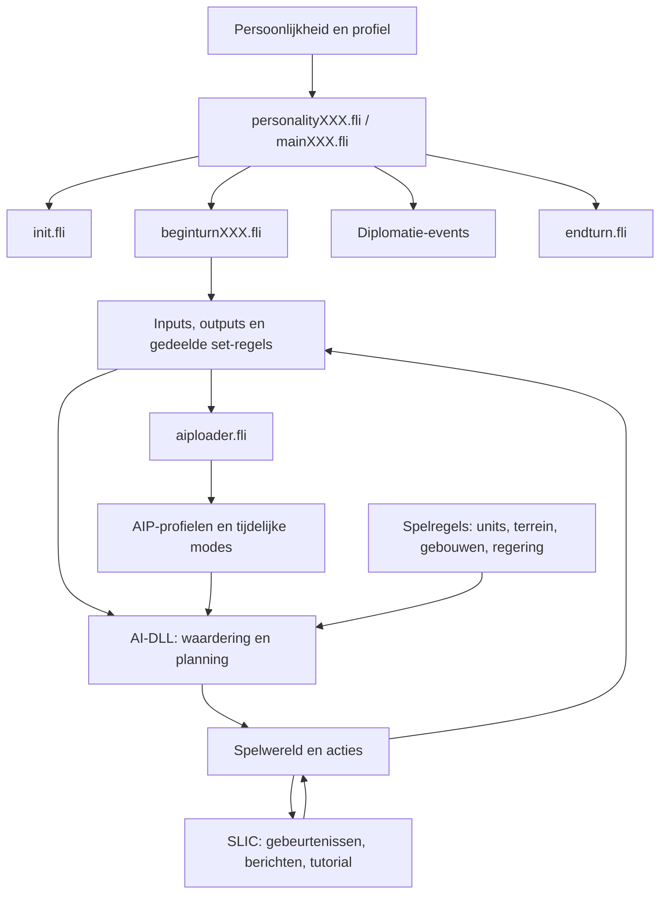

# Opbouw van de aanwezige CTP I-code en AI

## Reikwijdte en bewijs

Dit is een architectuuranalyse van de aanwezige installatiebestanden, geen volledige analyse van enginebroncode: die ontbreekt. De executable en robotcom-DLL bevatten de daadwerkelijke algoritmes. Linker-maps tonen symbolen en objectmodules, geen implementatie. We kunnen de tekstinterfaces volledig inventariseren, maar niet alle interne beslissingen verklaren.

Referentie: CTP-og. Leermodel: CTP-AAIP. Geen gameplaybestanden gewijzigd voor deze analyse. De eerdere SLIC-proef blijft los staan van de gekozen aanpak via bestaande AI-regels.

De inventaris vergelijkt alle 175 bestanden onder default/aidata en default/gamedata: 134 gelijk, 41 gewijzigd, geen bestanden uitsluitend aan één kant. Zie [bestanden.csv](INVENTARIS/bestanden.csv), [declaraties](INVENTARIS/declaraties.md) en [volledige AI-diffs](INVENTARIS/aaip-ai-diff.md). De declaratie-index verwijdert commentaren en registreert includes, inputs, outputs, loads, AIP-lijsten, scalars en defines. Dit is geen parser of bewijs dat elke regel wordt uitgevoerd.

## Lagen en afhankelijkheden

`ctp_program/ctp` bevat executable, gebruikersprofiel, saves en DLL's. `ctp_data/default/gamedata` bevat spelregels en scripts. `ctp_data/default/aidata` bevat fuzzy aansturing en AIP's. `ctp_data/english` bevat onder meer teksten en UI-layouts. Grafische bestanden vallen buiten deze analyse. Andere taal- en scenario-overrides zijn niet gelijkgesteld aan de normale default-route.

## Start en persoonlijkheden

De lokale aidata/README.txt zegt dat bestanden bij applicatiestart worden ingelezen en daarna geactiveerd volgens FLI of spelerindex. Een save herladen is dus geen aangetoonde manier om gewijzigde bestanden opnieuw in te lezen. De AIP-README noemt default.aip als eerste profiel.

Routes: Barbarians, Cleric, Slaver, SciFew, SciMany, WarFew en WarMany, plus Default. De persoonlijkheidsbestanden verwijzen naar main-bestanden; main-bestanden verbinden initialisatie, beginbeurt, diplomatie en einde beurt. Beginbeurtvarianten zetten flags voor type, onderzoekssnelheid en dicht/ruim vestigen. Controleer daadwerkelijke selectie vanuit het spelersprofiel wanneer we een benchmark starten.

De generieke personality.fli, main.fli en beginturn.fli worden door de README als templates beschreven. Die wijzigen is niet genoeg om alle actieve routes te veranderen. README's bevatten tevens historische bestandsnamen die niet aanwezig zijn: hun overzicht is uitleg, geen uitvoerbare laadlijst. De actuele includes in de index zijn leidend.

## FLI: van toestand naar waardering

`inputs.fli` benoemt enginegegevens en fuzzy sets voor onder meer steden, bevolking, beurten, oorlog, kaart, economie en tegenstanders. `outputs.fli` definieert uitgaande gewichten en hun fuzzy sets. `init.fli` definieert startwaarden en aanvullende waarderingsparameters. `output_aipnames.fli` levert flags voor profielkeuze.

Namen zoals low/med/high zijn labels; hun betekenis komt uit de numerieke definitie. AAIP verandert bijvoorbeeld centra van zulke sets zonder overal de regels te veranderen. Een regel die identiek blijft kan daardoor toch anders uitpakken. `tri`, `left`, `right`, `very` en combinaties drukken fuzzy aansturing uit; exacte defuzzificatie en runtimewaarden zijn nog niet gemeten. Vergelijk geen lidmaatschap met een harde boolean of eenheidstelling.

| Gedeeld bestand | Functie en koppeling |
| --- | --- |
| set_food_or_prod.fli | Opening, productiebelasting en groei-/productieverhouding; zet openingflag die andere regels beïnvloedt |
| set_resource_desire.fli | Gewichten voor bevolkingsinzet, voedsel, productie, goud en wetenschap; crisis-/legeruitzonderingen |
| set_budget.fli | Verdeling van economische uitgaven; beoordeel samen met wages, maintenance en science |
| set_wgf.fli | Workday, wages en food/rations; beïnvloedt productie, voedsel, kosten en geluk |
| set_pw.fli | Public Works-belasting onder economische en voorraadsvoorwaarden |
| set_inst_priority.fli | Wens voor mines, farms en roads; geen expliciete opdracht aan een specifieke tile |
| set_science_speed.fli | Onderzoekssnelheid en bijbehorende prioriteitsreacties |
| set_govern.fli | Voorkeuren voor regeringen; beschikbaarheid en daadwerkelijke overstap blijven enginewerk |
| set_military_readiness.fli | Militaire gereedheid; werkt door in onderhoud en inzetbaarheid |
| set_settle_density.fli | Packing, locatiegevoeligheid en patience; geen aangetoonde monopoly- of bergclassificatie |
| aiploader.fli | Conditionele profielkeuze en uitzonderingen voor opening, oorlog, eilanden, geluk en defensie |

Belangrijke afhankelijkheid: openingflag → groeiregels/PW/wegen; onderzoek → technologie/regering → gelukruimte → vestigingsstop; dreiging → defensieprofielen/legerquota → productie en wetenschap. Deze ketens verklaren waarom één waarde wijzigen vaak onvoldoende is.

## AIP: profielen voor de bestaande planner

Aipdef.h definieert lijststructuren: Build_List_Class (naam, prioriteit), Build_List_Element (unit, units_per_city), Building_Build_List_Element (gebouw, prioriteit), Advancement_Element (technologie). De gebouwprioriteitscommentaar is inconsistent met de veldnaam; niet als eenheidsquota lezen.

Persoonlijkheidsprofielen: default, barbarian, cleric, slaver, scifew, scimany, milfew, milmany. Ze bevatten algemene goalprioriteiten, modifiers, bouwduurgrenzen, goalgrenzen, eenheidsklassen en lijsten voor gebouwen, wonders en onderzoek. Dit zijn invoergegevens voor de planner, geen vast bouwscript voor iedere stad.

| Profielgroep | Aanwezige bestanden |
| --- | --- |
| Uitbreiding | masssettle, masssettle_sandbag, no_settle, yes_settle |
| Opening/verdediging | citywall, citywall_science, survival_mode, defend_normal, pull_units_into_city |
| Oorlog | getarmy, gather, takecity, fallback, siege_off, unit_focus |
| Marine | naval, supernaval |
| Verkenning/afstand | one_explore, two_explore, normal_explore, lowdist, highdist |
| Productieschakelaars | improvement_build_normal, build_troops_on, build_troops_off, noscience |
| Speciale acties/milieu | cleric_on, slave_on, special_attacks_off, sally, nosally, green_me |

Aanwezig zijn en actief geladen worden verschillen. Bijvoorbeeld green_me wordt als flag gezet in de loader, maar dat bewijst zonder actieve load-route geen toegepast profiel. Gebruik de index om voor elk profiel de aanvraag te volgen. Runtimevolgorde en persistentie van gedeeltelijke overrides zijn nog te bevestigen.

Er zijn meerdere prioriteitslagen: globale goals, klassen, individuele gebouwen en effectgewichten. Verschillende schalen mogen niet als één ranglijst worden gelezen. Negatieve eenheidsquota en negatieve goallimieten vragen verdere interpretatie; ze zijn geen negatief aantal gebouwen of bewezen twee settlers per stad.

## Diplomatie

Persoonlijkheidsroutes combineren peaceful/warlike met loyal/backstab. Diplomatie heeft afzonderlijke gebeurtenissen: begin, vóór inkomend bericht, vóór uitgaand bericht, geaccepteerd en afgewezen. Gedeelde regels gebruiken input_deals en input_responses voor afspraken en geheugen. Berichtcoëfficiënten en diplomatic_persistence in personality-bestanden sturen berichtkeuze/frequentie.

Diplomatie kan oorlog, veiligheid en uitbreidingsruimte beïnvloeden. Gewijzigde dialoogtekst is op zichzelf geen gewijzigde AI-beslissing. AAIP wijzigt beide; zie [AAIP-lessen](AAIP-LESSEN.md).

## Spelregels en SLIC

Advance, govern, units, improve, wonder, terrain, tileimp en Const leggen mogelijkheden, kosten en grenzen vast. AI-prioriteiten maken alleen keuzes binnen die mogelijkheden. Aanpassingen van globale spelregels kunnen ook de mens raken; scheid ze daarom van betere AI-beslissingen. De aanwezige economische details zijn uitgewerkt in de bestaande early-game- en stadsmodelanalyses.

script.slc bevat veel berichten en eventafhandeling; tutorials demonstreren SLIC-functies. Die scripts zijn niet de implementatie van de gewone stadsplanner. De SLIC-bestanden in de geïnventariseerde default/gamedata zijn gelijk tussen origineel en AAIP. Onze eigen proefkopie heeft aanvullingen, maar die behoren niet tot de originele vergelijking.

## Gecompileerde laag en grens van de analyse

robotcom.map noemt onder meer CityAgent, bevolkingsplaatsing, locatie-/settlerplanning en handel. civctp.map noemt engine- en scriptinterfaces. Ze ondersteunen dat deze subsystemen bestaan. Ze geven geen volledige scoreformules, uitvoerbare vervangende broncode of garantie dat interne functies als SLIC-API beschikbaar zijn.

Exacte per-stadclassificatie, drie specifieke bergwerkers, specialistenaantallen en monopolybestemmingen zijn nog niet bewezen configureerbaar. Gebruik eerst bestaande gewichten en observeer wat ze werkelijk doen; programmeer geen fictieve input voor ontbrekende stadsinformatie.

## Onderzoek vóór implementatie

De technische uitwerking van het gemeenschappelijke profiel, conflicten met bestaande modes en de validatieprocedure staan in [GEDEELDE-OPENING.md](GEDEELDE-OPENING.md). Belangrijke beperking: num_cities is beschikbaar, maar een terugmelding van actieve Theocracy is nog niet als FLI-input aangetoond.

Ontwerpkeuze met de gebruiker: alle normale AI-persoonlijkheden krijgen een gezamenlijke opening richting 25–30 steden en Religion → Theocracy, met beperkte noodzakelijke legerlast en eventueel een Labyrinth-stad. Persoonlijkheidsverschillen krijgen daarna meer invloed. De gewenste overgang vereist doelomvang en actieve Theocracy; de precieze stadsgrens blijft open. Tijdelijke reacties op dreiging, gebrek aan ruimte of ernstige gelukproblemen blijven mogelijk. Basisregels voor locaties, stadstypen en nuttige gebouwen blijven ook na de opening gelden. Barbaren worden afzonderlijk behandeld.

Onderzoek hiervoor een gedeeld FLI/AIP-openingsprofiel en de samenwerking met overrides. De oorspronkelijke persoonlijkheid hoeft niet te worden verwijderd; haar invloed wordt in de opening begrensd. Dit is vastgelegd ontwerp, nog geen geïmplementeerd of getest gedrag.

De bestandsopbouw en verschillen zijn nu vastgelegd. Nog open: negatieve quota, actieve profielroute per AI, overridevolgorde, werkelijk tile-/bouwscoremodel en betrouwbare baseline vanaf dezelfde start. Voor iedere projectregel moeten we vervolgens de keten input → FLI/AIP → enginekeuze → meetbaar gedrag invullen. Verander uitbreiding, onderzoek/regering, legerlast en gebouwen in afzonderlijke experimenten voordat we ze combineren.
